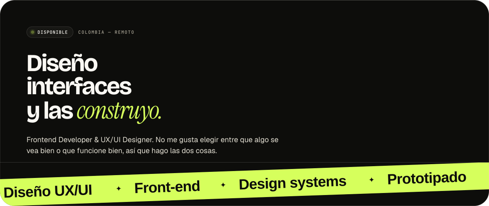
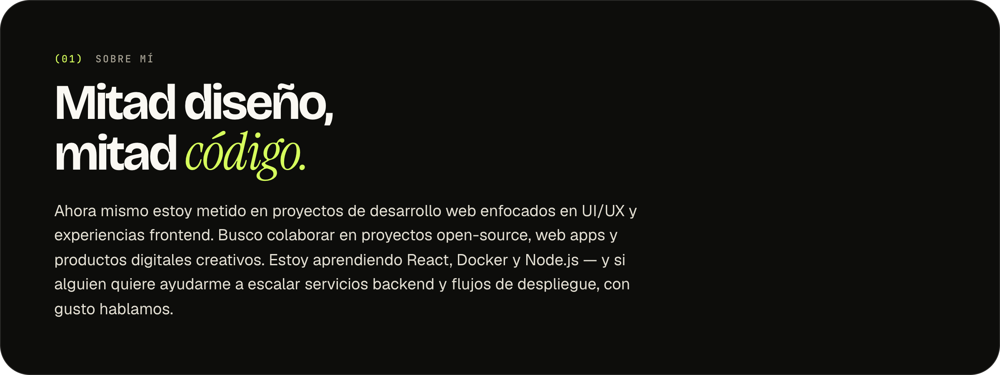
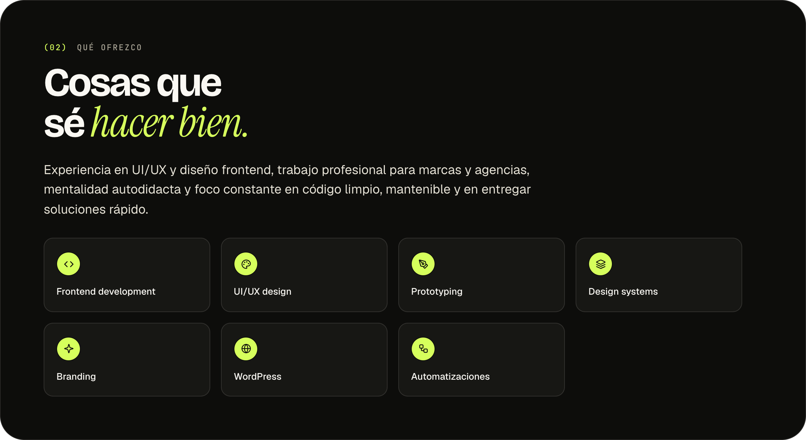
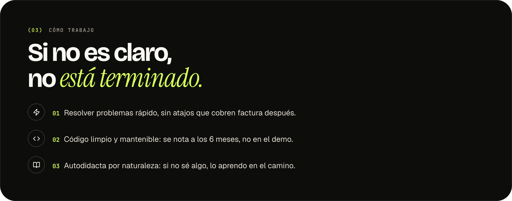
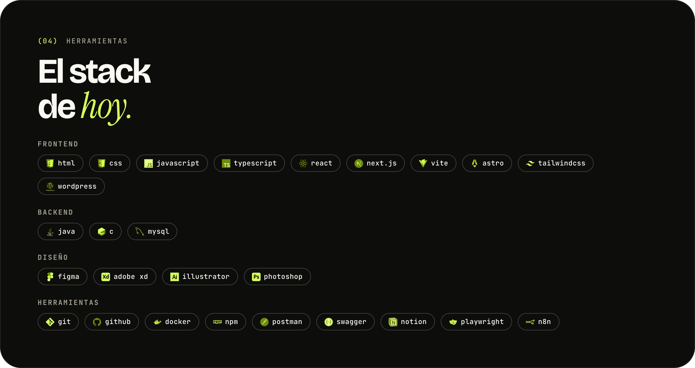
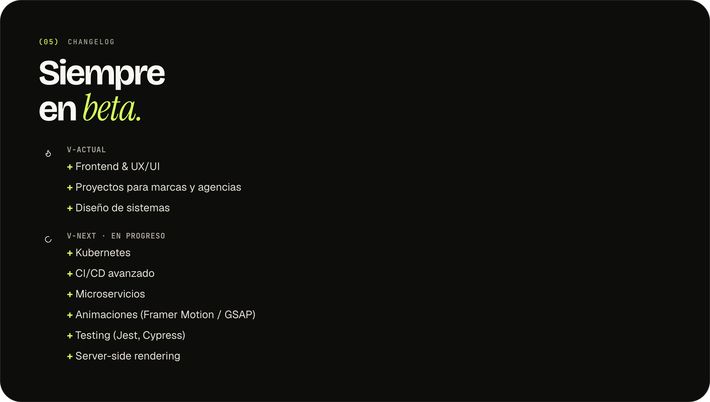
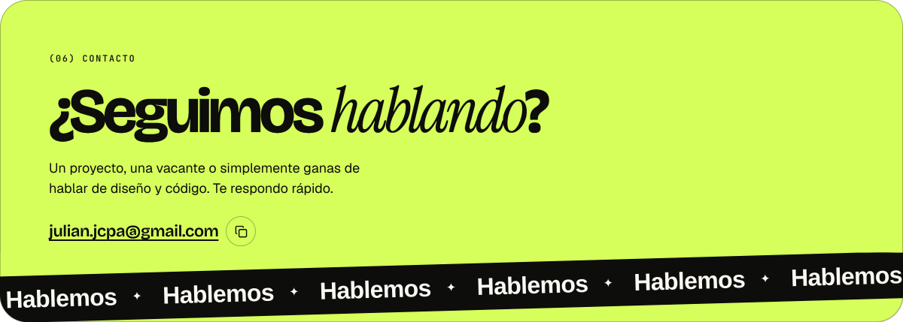

<!--
  Perfil de Julian Camilo Pinzón Ariza.
  Todos los paneles son capturas reales del sistema de diseño
  (scripts/design-system: los tokens y componentes compilados reales —
  SectionHeader, Badge, Tag, Marquee, IconButton — no una recreación
  aproximada). Para regenerarlos: editar scripts/render-content.mjs y
  correr `npm run build:assets` (trae los íconos del stack con devicon.dev,
  escribe scripts/design-system/render/*.html y los captura con Puppeteer a
  assets/*.png).

  Los paneles hero y contact son la excepción: cada uno es un único
  hero.svg / contact.svg, no un PNG. Un  sigue siendo un
  documento SVG vivo aunque GitHub no ejecute JS/CSS en el README en sí:
  sus propios @keyframes sí corren, así que la cinta inferior se mueve de
  verdad — sin capturas, sin GIF pesado, texto nítido a cualquier tamaño.
  El contenido de arriba (titular, texto) sigue siendo la captura real de
  Puppeteer de siempre — scripts/capture.mjs la toma como PNG en memoria y
  la embebe como <image> base64 dentro del propio SVG — y la cinta de abajo
  es texto SVG real armado a mano por scripts/lib/marquee-svg.mjs (con
  textLength para que el loop calce exacto), todo en un solo archivo, sin
  costura entre dos imágenes separadas que mantener alineadas.

  Los íconos de contacto de abajo (assets/social/*.svg) son la otra parte
  del README que NO es una captura: son SVGs reales dentro de <a href> de
  verdad, así que sí son clicables en GitHub. Se regeneran con
  `npm run fetch:social-icons` (scripts/social-links.mjs es la fuente de
  verdad de los links).
-->

<p align="center">
  
</p>

<p align="center">
  
</p>

<p align="center">
  
</p>

<p align="center">
  
</p>

<p align="center">
  
</p>

<p align="center">
  
</p>

<p align="center">
  
</p>

<p align="center">
  <a href="mailto:julian.jcpa@gmail.com"></a>
  &nbsp;
  <a href="https://linkedin.com/in/Julianjcpa"></a>
  &nbsp;
  <a href="https://behance.net/julianariza3"></a>
  &nbsp;
  <a href="https://instagram.com/julian.c.ariz"></a>
  &nbsp;
  <a href="https://x.com/Julian_c_ariz"></a>
  &nbsp;
  <a href="https://discord.com/users/302319395626156032"></a>
</p>

<!-- texto:inicio -->
<details>
<summary><strong>Versión en texto / English version</strong> · <code>README --no-images</code></summary>
<br>

```ts
// julian.config.ts
export const julian = {
  nombre: 'Julian Camilo Pinzón Ariza',
  rol: ['Frontend Developer', 'UX/UI Designer'],
  base: 'Colombia',
  version: 'siempre-en-beta',
  principio: 'que algo se vea bien y funcione bien, no una u otra cosa',
} as const
```

#### Sobre mí

- Ahora mismo: proyectos de desarrollo web enfocados en UI/UX y experiencias frontend.
- Busco colaborar en: proyectos open-source, web apps y productos digitales creativos.
- Busco ayuda con: escalar servicios backend y flujos de despliegue.
- Aprendiendo: React, Docker y Node.js.

#### Qué ofrezco

`frontend development` · `ui/ux design` · `prototyping` · `design systems` · `branding` · `landing pages con wordpress`

Experiencia en UI/UX y frontend para marcas y agencias, mentalidad autodidacta y foco constante en código limpio, mantenible y en entregar soluciones rápido.

#### Cómo trabajo

| | Principio | En la práctica |
|:-:|:--|:--|
| `01` | **Resolver rápido** | Sin atajos que cobren factura después. |
| `02` | **Código limpio** | Mantenible — se nota a los 6 meses, no en el demo. |
| `03` | **Autodidacta** | Si no sé algo, lo aprendo en el camino. |

#### Herramientas

`HTML` · `CSS` · `JavaScript` · `TypeScript` · `React` · `Astro` · `Tailwind CSS` · `WordPress` · `Java` · `C` · `MySQL` · `Figma` · `Adobe XD` · `Illustrator` · `Photoshop` · `Git` · `GitHub` · `Docker` · `NPM` · `Postman` · `Swagger` · `Notion`

#### Changelog

```diff
@@ v-actual @@
+ Frontend & UX/UI
+ Proyectos para marcas y agencias
+ Diseño de sistemas

@@ v-next · en progreso @@
+ Kubernetes
+ CI/CD avanzado
+ Microservicios
+ Animaciones (Framer Motion / GSAP)
+ Testing (Jest, Cypress)
+ Server-side rendering
```

#### Contacto

```sh
$ julian --contacto
> julian.jcpa@gmail.com
> linkedin.com/in/Julianjcpa
> behance.net/julianariza3
> instagram.com/julian.c.ariz
> x.com/Julian_c_ariz
```

[**Escríbeme**](mailto:julian.jcpa@gmail.com) · [**LinkedIn**](https://linkedin.com/in/Julianjcpa) · [**Behance**](https://behance.net/julianariza3) · [**Instagram**](https://instagram.com/julian.c.ariz) · [**X**](https://x.com/Julian_c_ariz)

<sub>Julian Camilo Pinzón Ariza · siempre en beta.</sub>

---

### English version

**Julian Camilo Pinzón Ariza** — Frontend Developer & UX/UI Designer, Colombia.
I don't like choosing between something that looks good and something that works well, so I do both: I design the interface and I build it.

**About me:** currently working on web development projects focused on UI/UX and frontend experiences. Looking to collaborate on open-source projects, web apps and creative digital products. Looking for help scaling backend services and deployment workflows. Currently learning React, Docker and Node.js.

**What I offer:** frontend development, UI/UX design, prototyping, design systems, branding, and landing pages with WordPress. Experience in UI/UX and frontend design for brands and agencies, a self-taught mindset, and a constant focus on clean, maintainable code.

**How I work:**
1. Solve problems fast, without shortcuts that cost more later.
2. Clean, maintainable code — it shows at month six, not in the demo.
3. Self-taught by nature: if I don't know something, I learn it along the way.

**Tools:** HTML, CSS, JavaScript, TypeScript, React, Astro, Tailwind CSS, WordPress, Java, C, MySQL, Figma, Adobe XD, Illustrator, Photoshop, Git, GitHub, Docker, NPM, Postman, Swagger, Notion.

**Changelog:** current — frontend & UX/UI work, projects for brands and agencies, design systems. Next, in progress — Kubernetes, advanced CI/CD, microservices, animation (Framer Motion / GSAP), testing (Jest, Cypress), server-side rendering.

**Contact:** a project, an opening, or just want to talk design and code? [Email me](mailto:julian.jcpa@gmail.com) · [LinkedIn](https://linkedin.com/in/Julianjcpa) · [Behance](https://behance.net/julianariza3) · [Instagram](https://instagram.com/julian.c.ariz) · [X](https://x.com/Julian_c_ariz)

</details>
<!-- texto:fin -->
